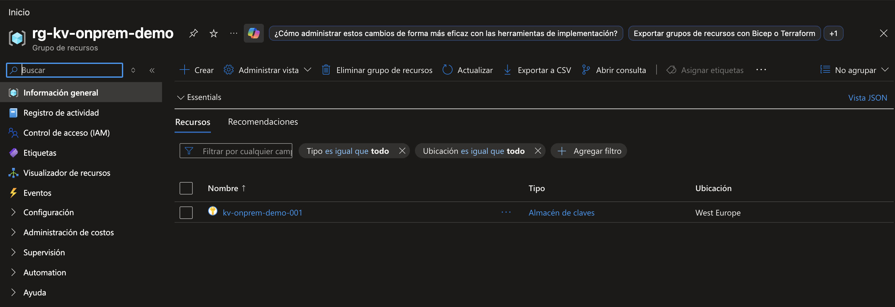
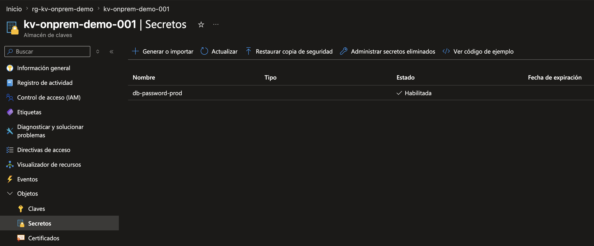
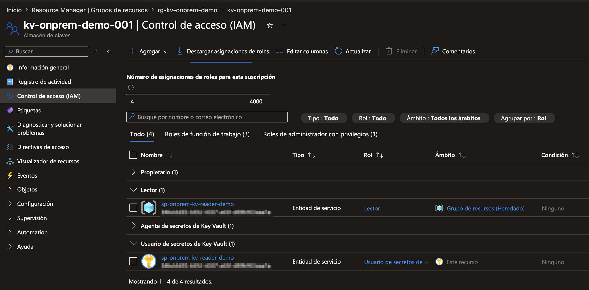

# Hello Azure KeyVaults

# ¿Que tenemos por aqui?
Del mismo modo que cuando empezamos a aprender un lenguaje de programación se suele comenzar con un ejemplo sencillo para mostrar un mensaje simple en pantalla (Hello World u Hola Mundo), este repositorio pretende ser un "Hola Mundo" para la implementación y uso de almacenes de secretos en Azure como medio seguro para almacenar datos sensibles (como contraseñas, tokens, certificados) y cómo acceder a esta información de forma segura desde nuestro código (aplicaciones, scripts, autotizaciones...). De ese modo sirve como base para su implementación en otros proyectos.

- Creación de almacén de secretos en Azure y protección del mismo
- Creación y actualización de secretos dentro del almacén
- Acceso a secretos desde un script python
- Acceso a secretos desde Ansible 

# Requisitos
Para comenzar, es imprescindible contar con acceso a Azure con permisos administrativos para poder crear el almacén de secretos (KeyVault). Si no dispones de una cuenta en Azure, puedes conseguir una gratuita con una cuenta de Microosft asociada a tu dirección de correo personal [en esta página de Microsoft](https://azure.microsoft.com/es-es/pricing/purchase-options/azure-account/)

Una vez creado el almacén, necesitaremos tener instalado [python](https://www.python.org/downloads/) si queremos probar el acceso mediante el ejemplo proporcionado en este lenguaje, o de [ansible](https://docs.ansible.com/), para probar el funcionamiento del ejemplo proporcionado para esta herramienta.


# 1) Qué piezas intervienen
Piensa en 4 piezas:

**El vault**

Es donde guardas el secreto. Key Vault puede almacenar secretos, claves y certificados.

**La identidad de la aplicación**

Tu servidor on‑prem no “entra” al vault como máquina; entra una identidad (normalmente un service principal). Microsoft documenta dos opciones para ese service principal: con password/secret o con certificado; y recomienda certificado por ser más seguro.

**Los permisos**

En Key Vault el acceso se separa entre plano de control (crear/administrar el vault) y plano de datos (leer/escribir secretos). Con RBAC puedes dar, por ejemplo, solo Key Vault Secrets User para leer o Key Vault Secrets Officer para gestionar secretos.

**La red**

Tu servidor on‑prem necesita llegar a:

Microsoft Entra ID para autenticarse,
el endpoint del vault https://<vault>.vault.azure.net,
y, si va a crear/configurar recursos, también a management.azure.com.
Todo eso va por HTTPS 443; ocasionalmente puede haber tráfico HTTP 80 para comprobaciones de revocación de certificados (CRL).

# 2) Qué patrón te recomiendo para un servidor on‑prem
**Opción A — La más práctica y universal**

Servidor on‑prem + service principal con certificado + Key Vault RBAC + firewall/IP allowlist
Es la mejor para empezar porque:

funciona con Linux/Windows on‑prem,
no depende de que el servidor esté en Azure,
evita meter passwords fijos de Azure en el servidor,
y es fácil de automatizar desde Python, PowerShell o shell.

**Opción B — La más cerrada de red**

Lo mismo que arriba, pero con Private Endpoint y acceso privado desde on‑prem a Azure
Es la opción más robusta a nivel de red:

el vault se expone por IP privada en una VNet,
puedes deshabilitar el acceso público,
y desde on‑prem llegas al vault por tu conectividad híbrida y con DNS adecuado.
Microsoft indica además que, si conectas desde on‑prem a un Key Vault con Private Endpoint, debes tener bien configurados los DNS forwarders/resolución para vault.azure.net y vaultcore.azure.net.

**Recomendación:**

Empieza por la Opción A si quieres algo operativo ya; evoluciona a Opción B si el vault va a guardar credenciales muy sensibles o si tu política de seguridad exige que no exista punto de acceso público.


# 3) Ejemplo práctico completo
## Creación del almacén de secretos en Azure

Vamos a montar este escenario:

- Admin de Azure crea el vault y el secreto.
- Aplicación en servidor on‑prem solo necesita leer el secreto.
- La autenticación del servidor on‑prem se hace con service principal + certificado.
- El servidor on‑prem usará Python con azure-identity y azure-keyvault-secrets

### Paso 1. Crear el Key Vault
Microsoft documenta que puedes crear el vault con Azure CLI y recomienda habilitar [**RBAC** y **purge protection**](https://learn.microsoft.com/en-us/azure/key-vault/secrets/quick-create-cli).

Accede al [Portal de Azure](https://portal.azure.com) e inicia sesión con tu cuenta.

Abre una consola de Cloud Shell (icono cuadrado arriba a la derecha con forma de terminal)

Lo habitual es que se abra una terminal de tipo Power Shell, si es asi, cambia a una terminal tipo Bash para continuar.

TIP: Si desde la terminal clonas este repositorio te evitas copiar y pegar el código que te indico a continuación y tan sólo tendrás que editar el script proporcionado con los valores de acuerdo a tu entorno/preferencias.

Clonar repositorio: `git clone https://github.com/rattler-endais/helloazurekeyvaults.git`

TIP: Si tienes Azure CLI instalado también puedes realizar los siguientes pasos desde una terminal de tu ordenador.


**Crear el grupo de recursos y el almacén de secretos** [^1][^2]
```shell
# Variables de ejemplo
RG="rg-kv-onprem-demo" # Nombre del Grupo de Recursos
LOC="westeurope" # Localización
KV="kv-onprem-demo-001" # Nombre del almacén de secretos
SUB_ID="<Indica aqui tu id de suscripción>" #Id de la suscripción de Azure

# Crear grupo de recursos
az group create --name "$RG" --location "$LOC"

# Crear Key Vault con RBAC y purge protection
az keyvault create \
  --name "$KV" \
  --resource-group "$RG" \
  --enable-rbac-authorization true \
  --enable-purge-protection true
```
¿Qué has hecho aquí?

- has creado el contenedor lógico (resource group),
- has creado el vault,
- y has activado dos cosas importantes:

    - RBAC para permisos modernos,
    - purge protection para evitar borrado permanente prematuro


Si todo ha ido bien, dentro del Portal de Azure podrás ver el almacén de secretos con el **Resource Manager** dentro del grupo de recursos creado.




[^1]: Si al crear el KeyVault obtienes un mensaje de error de tipo `(MissingSubscriptionRegistration) The subscription is not registered to use namespace 'Microsoft.KeyVault'` puedes seguir los pasos descritos [aqui](https://learn.microsoft.com/en-us/azure/azure-resource-manager/troubleshooting/error-register-resource-provider?tabs=azure-cli) para solucionarlo, que básicamente consiste en registrar 'Microsoft.KeyVault' con la suscripción ejecutando `az provider register --namespace Microsoft.KeyVault` y luego lo verificas con `az provider list --query "[?registrationState=='Registered']" --output table` o con `az provider list --query "[?namespace=='Microsoft.KeyVault']" --output table`

[^2]: Para obtener el id de suscripción, puedes hacer algo como esto
`SUB_ID=$(az account show --query id -o tsv)`
y consultar el valor con `echo $SUB_ID`


[ ] Marcar como completado

### Paso 2: Darte acceso al almacén de secretos
Después de haber creado el almacén de mensajes y haberlo securizado mediante RBAC no podrás guardar secretos directamente hasta que no tengas el rol adecuado. 

Asigna el rol necesario a tu "User Principal Name" (UPN), usando este comando, teniendo en cuenta sustituir `<upn>` por el valor adecuado, que normalmente tiene el formato de una dirección de correo electrónico (username@domain.com).

```shell
az role assignment create --role "Key Vault Secrets Officer" --assignee "<upn>" --scope "/subscriptions/$SUB_ID/resourceGroups/$RG/providers/Microsoft.KeyVault/vaults/$KV"
```

[ ] Marcar como completado

### Paso 3. Crear el secreto
Microsoft documenta la creación del secreto con [**az keyvault secret set**](https://learn.microsoft.com/en-us/azure/key-vault/secrets/quick-create-cli)

Supón que quieres crear un secreto que almacenarás con el nombre `db-password-prod` con el valor `SuperSecretoTemporal-2026!`. Para ello ejecutarás algo como:
```shell
az keyvault secret set \
  --vault-name "$KV" \
  --name "db-password-prod" \
  --value "SuperSecretoTemporal-2026!"
```

Si todo ha ido bien hasta ahora, podrás ver el secreto creado dentro del almacén de secretos.



[ ] Marcar como completado

### Paso 4 (opcional). Verificar que puedes ver el contenido del secreto desde la Cloud Shell
Se que estás deseando usar este secreto desde tu aplicación, pero primero puedes verificar que puedes acceder al valor almacenado desde la propia cloud shell que has usado hasta ahora.

```shell
az keyvault secret show --name "db-password-prod" --vault-name "$KV" --query "value"
```

[ ] Marcar como completado

### Paso 5. Crear la identidad que usará el servidor on‑prem
Para un entorno on‑prem, la forma más limpia es [crear un service principal con certificado](https://learn.microsoft.com/en-us/cli/azure/azure-cli-sp-tutorial-3?view=azure-cli-latest). Microsoft recomienda esta opción frente a password/secret.

**Crearlo con certificado auto-generado por Azure CLI**

```shell
SUB_ID=$(az account show --query id -o tsv)
SCOPE="/subscriptions/$SUB_ID/resourceGroups/$RG"

az ad sp create-for-rbac \
  --name "sp-onprem-kv-reader-demo" \
  --role Reader \
  --scopes "$SCOPE" \
  --create-cert
```

Como resultado, verás algo similar a esto

```
Creating 'Reader' role assignment under scope '/subscriptions/<suscripcion>/resourceGroups/rg-kv-onprem-demo'
The output includes credentials that you must protect. Be sure that you do not include these credentials in your code or check the credentials into your source control. For more information, see https://aka.ms/azadsp-cli
Please copy <ruta_certificado_generado> to a safe place. When you run `az login`, provide the file path in the --certificate argument
{
  "appId": "id_aplicacion",
  "displayName": "sp-onprem-kv-reader-demo",
  "fileWithCertAndPrivateKey": "/home/usuario/tmpxxxx.pem",
  "password": null,
  "tenant": "tenant_id"
}
```

Este comando te devuelve, entre otras cosas:
- appId
- tenant
- y la ruta del fichero con certificado + private key en formato PEM.

Microsoft indica que copies ese certificado a un lugar seguro, porque contiene la clave privada, y también te indica cómo [resetear al service principal](https://learn.microsoft.com/en-us/cli/azure/azure-cli-sp-tutorial-7?view=azure-cli-latest&tabs=bash) si pierdes el certificado, pero tu y yo sabemos que eso no va a pasar ¿o si?

Igual estarás pensando... Muy bien, ya he generado el Service Principal con certificado, pero se me ha generado en una ruta de la Cloud Shell ¿y ahora cómo me lo guardo?

Muy sencillo, puedes descargarlo simplemente ejecutando esto

`download </ruta_temporal_certificado_generado_en_paso_anterior>`

Y ahora que lo has descargado, almacenalo en lugar seguro.

**Muy importante:**

Aunque el SP tenga un rol “Reader” sobre el resource group, eso no le da acceso al valor de los secretos. Para leer secretos necesitas un rol de plano de datos del Key Vault, por ejemplo Key Vault Secrets User.

[ ] Marcar como completado


### Paso 6. Dar solo el permiso mínimo sobre el vault
Si tu aplicación solo va a leer secretos (y no crearlos o actualizarlos), dale Key Vault Secrets User. Microsoft [describe ese rol](https://learn.microsoft.com/es-es/azure/key-vault/general/rbac-guide?tabs=azure-cli) como el que permite leer el contenido del secreto.

```shell
APP_ID="<appId-devuelto-por-el-comando-anterior>"
KV_SCOPE="/subscriptions/$SUB_ID/resourceGroups/$RG/providers/Microsoft.KeyVault/vaults/$KV"

az role assignment create \
  --role "Key Vault Secrets User" \
  --assignee "$APP_ID" \
  --scope "$KV_SCOPE"
  ```


Si no has tenido problemas, ahora deberias ver que el service principa que acabas de crear ya tiene permisos de lectura sobre el almacén de secretos



**Regla simple de mínimos privilegios**

    Admin que crea secretos: Key Vault Secrets Officer
    Aplicación que solo lee: Key Vault Secrets User

[ ] Marcar como completado

### Paso 7. Asegurar la red del vault
Tienes dos caminos.

**Camino 7A. Rápido: limitar por IP pública fija**

Si tu servidor on‑prem sale a internet por una NAT/IP pública fija, puedes habilitar el firewall del vault y permitir solo esa IP/CIDR. Microsoft [documenta](https://learn.microsoft.com/en-us/azure/key-vault/general/network-security?tabs=azure-portal) precisamente este patrón para servicios con IP estática.

Qué hacer en el portal de Azure:

1. Entrar en el Key Vault.
2. Configuración > Redes.
3. Elegir *Permitir el acceso público desde redes virtuales y direcciones IP específicas*.
4. Añadir tu IP o rango CIDR.
5. Guardar.

Esto es seguro y sencillo si tu salida a internet está bien controlada.

**Camino 7B. Más fuerte: Private Endpoint**

Si quieres que el vault no tenga acceso público, Microsoft documenta que puedes:

- crear un Private Endpoint del vault en una VNet,
- deshabilitar el acceso público,
- y validar que el nombre del vault resuelve a una IP privada desde la red autorizada.

Si accedes desde on‑prem a ese Private Endpoint, la propia [documentación](https://learn.microsoft.com/en-us/azure/key-vault/general/private-link-service?tabs=portal) remarca que debes tener correctamente configurada la resolución DNS (forwarders/zones) para que tuvault.vault.azure.net resuelva por la ruta privada.

[ ] Marcar como completado

### Paso 8. Qué puertos y salidas debe tener el servidor on‑prem
Para leer secretos en tiempo de ejecución, el servidor necesita poder salir por HTTPS 443 hacia:

https://login.microsoftonline.com (autenticación),

https://\<vault\>.vault.azure.net (data plane del Key Vault).

Si además vas a crear/configurar el vault desde ese mismo servidor, también necesitas https://management.azure.com:443. 

Microsoft también [indica](https://learn.microsoft.com/en-us/azure/key-vault/general/access-behind-firewall) que puede aparecer tráfico HTTP 80 ocasional por CRL.

[ ] Marcar como completado

### Paso 9. Copiar el certificado al servidor on‑prem de forma segura
Aquí no hay magia, ese PEM con private key es la credencial del servidor, asi que guardala bien en lugar seguro.

Si no lo hiciste ya en el Paso 5, puedes dsecargarlo simplemente ejecutando esto:
`download </ruta_temporal_donde_se_genero_el_certificado>`


Buenas prácticas:
- guardarlo fuera del código y fuera del repositorio Git,
- permisos del fichero 600 en Linux,
- dueño específico del usuario de servicio,
- si el servidor es Windows, ubicarlo en almacén/carpeta protegida,
- y rotarlo cuando toque.

Microsoft [indica](https://learn.microsoft.com/en-us/cli/azure/authenticate-azure-cli-service-principal?view=azure-cli-latest) que el certificado debe estar disponible localmente y que, para az login, el PEM debe incluir private key + certificate juntos en el mismo fichero. 

[ ] Marcar como completado


## Acceso al secreto desde python
### Paso 1.
Microsoft [documenta](https://learn.microsoft.com/en-us/python/api/overview/azure/identity-readme?view=azure-python) el uso de DefaultAzureCredential y SecretClient para autenticarse y consumir secretos de Key Vault

Instalar dependencias

```shell
pip install azure-identity azure-keyvault-secrets
```

---

## Acceso al secreto desde ansible


